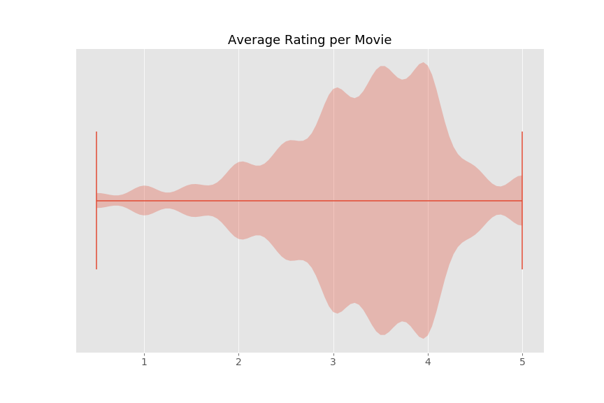
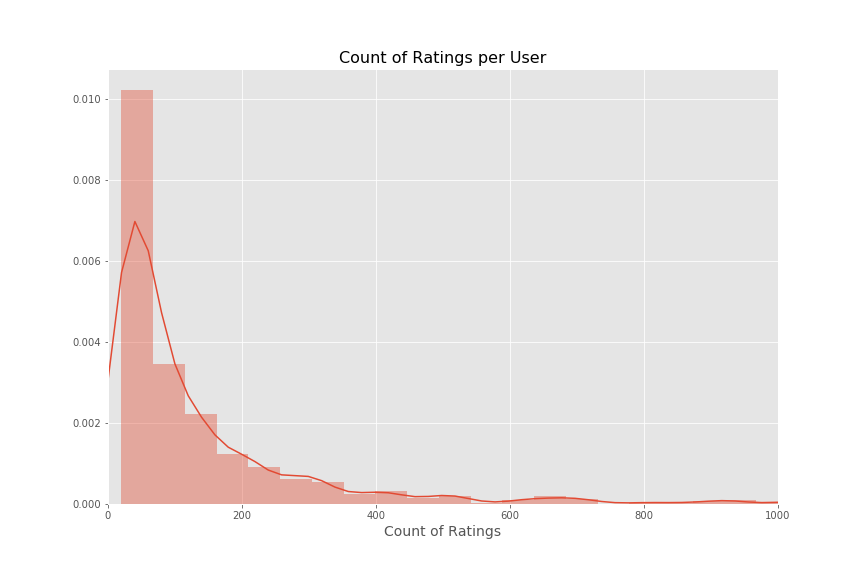
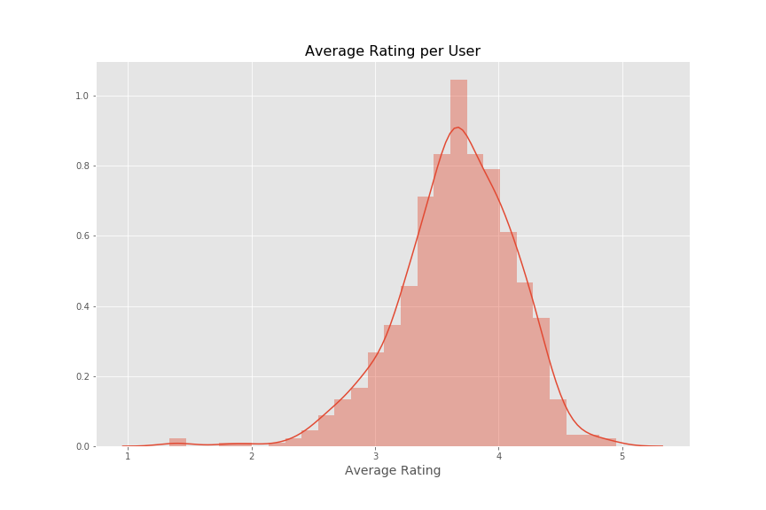
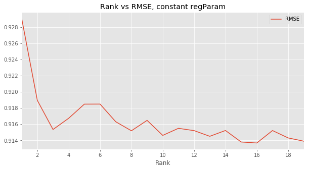

# Movie Recommender Case Study

#### Team: Alyse Record, Daniel Kim, Kyle Schutter, Jarred Bultema

 

The Case Study
--------------------------------------

You and a team of talented data scientists are working for the
company, **Movies-Legit**, who has used a production recommenders for
many years now.  The recommender provides a significant revenue stream
so your managers are heisitent to touch it.  The issue is that these
systems have been around a long time and your head of data science has
asked you and your team members to explore new solutions.

The solution that has been around for so long is called the **Mean of
Means**.  We see that some users like to rate things highly---others
simply do not.  Some items are just better or worse.  We can capture
these general trends through per-user and per-item rating means. We
also incorporate the global mean to smooth things out a bit. So if we
see a missing value in cell R_{ij}, we'll average the global
mean with the mean of U_i and the mean of V_j and use
that value to fill it in.

We would like you to use this as a baseline when making your
comparisons.  The basic code showing you how this is done is provided
for you in `Baselines.py`.
   
At the end of the day you are to present your solution to the bosses
and the entire product team.  You can assume that they have little to no
depth of knowledge in statistics and big data technologies.

The main goal here is to **improve the RMSE**, however, another equally
important goal is to **present your model and the details of your
explorations** in a clear, but technically sound manner.  *You need to
convince us that you understand the tools you are using AND that it is
a better way forward.* After all we are making a lot of money with
*mean of means* and it is a major risk to swap it out with anything else.

We would also like you to include some discussion about how you would
move from prototype to production.

The data
--------------

MovieLens, is a classical recommender dataset composed of over 27 Million moving ratings from 280,000 users. Reviews of 58,000 movies include a numerical score and may include free-text entries from users as tags. For this case-study, a small fraction of the dataset was used for development of the recommender.

The reduced dataset consists of 100,000 user reviews from 671 user on over 9,000 movies. While substantial, this data represents a very spare matrix, with only 1.64% data density in the original data and 1.42% and 0.61% density in the train and test splits, respectively. As a result, a recommender on this system will need to accomodate the sparsity of data, which eliminates several recommender approaches. 

Within the data, there is a non-normal distribution of of ratings of movies, with the majority of ratings falling between 3 - 4 on a scale of 1 - 5 (worst - best). Additionally, we observe that increment of 0.5 within ratings to provide a discrete distribution.

 

Suprisingly, very few movies receive a large number of very-low or very-high ratings

Most users provided fewer than 50 movie ratings which contributes to why the matrix is so spare. As seen in the below distribution plot, there is a concentration of users who rated 200 or few movies with a much smaller population of users that that rated 200+ movies.

 

When looking at the average rating given by user, the distribution is fairly normal, skewing slightly to the right meaning users are more likely to provide favorable ratings on average.

 

Approach
--------------

Given the nature of the dataset, two different approaches could be used for a recommender. A content-based recommendation system could be used to recommend movies based on similar features. Movie information and user-entered tags allow for a large corpus that could be used in latent feature analysis. Recommendations would be based on similarities between movies based on latent features, and correlated to user reviews of movies to understand user preferences.

 

Alternatively, a collaboratie filtering recommendation system could be used with only the numerical rating data from users for movies. This approach allows for user-user, item-item, and user-item comparisons. The low density of this data, however, restricts the available approaches as sparse data restricts the ability to perform a neighborhood-based collaborative filtering. Further, the sheer volume of data in the full data set makes this approach extremely resource intensive as distances between all movies must be held in memory along with user-user distances.

 

Instead, a non-negative matrix factorization approach allows for the determination of user-embedded and movie-embedded latent factors from the matrix of the user-movie ratings into the matrices U and V. While the factorization approach itself is time-consuming, the results of this matrix factorization allow for the direct prediction of movie ratings for any user. Construction of this user-movie matrix on a sample of the data itself is a time-consuming process, and results in a (671 X 9,066) matrix with 1.64% density. Given the abundance of missing values, typical matrix factorization approaches cannot be used. Instead, a specialized matrix factorization approach known as "Fund SVD" is employed.

 

Funk SVD allows for factorization of incredibly spare matrices because it ignores missing values and only uses present values to compute latent factors. In this approach, values are predicted individually for each user and for each film and compared to a true user rating. For each user, all rated films are used and for each film all ratings are used. A dot-product of these two vectors is used to create a predicted user rating for a film with a true user-rating. This predicted rating is compared to the true user-rating in a cost function, and a gradient descent approach is used to minimize the prediction error. 

The following formula describe the gradient descent for any user (i) and movie (j): 

min( U(i) or V(j) + ⍺ 2(true - predicted) x V(j) or U(i)) , where ⍺ is the learning rate.

For this implementation we chose the the Spark ALS collaborative filtering recommendation system, so that after the model was trained on a subset of the data, it could be run on a much larger scale with more data. 

In order to determine appropriate hyper-parameters of the Spark ALS model, an initial random Grid Search was performed on approximately 10% of the possible hyper-parameters on the Funk SVD model on training data. A smaller Grid Search was performed using a narrow range of hyper-parameter values. 

Manually performing a random gridsearched narrowed us down to a rank of 2 and learning rate of 0.15. However, when we ran a full grid search of rank 1-20, there was a smaller optimal hyper- parameter global minima of 16, albiet more local and thus harder to find by hand.  

  

Conclusion
--------------
Using a Spark ALS collaborative filtering recommendation system, the RMSE was improved by 17.8% over the existing model. And since this model is built in Spark, it can be scaled to a much larger dataset for production use.

